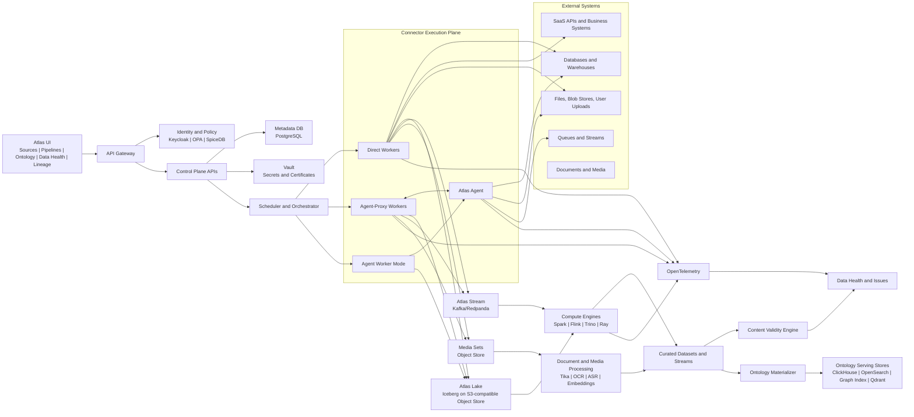
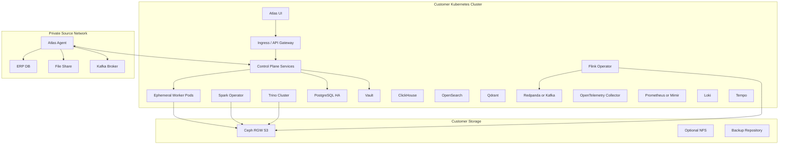
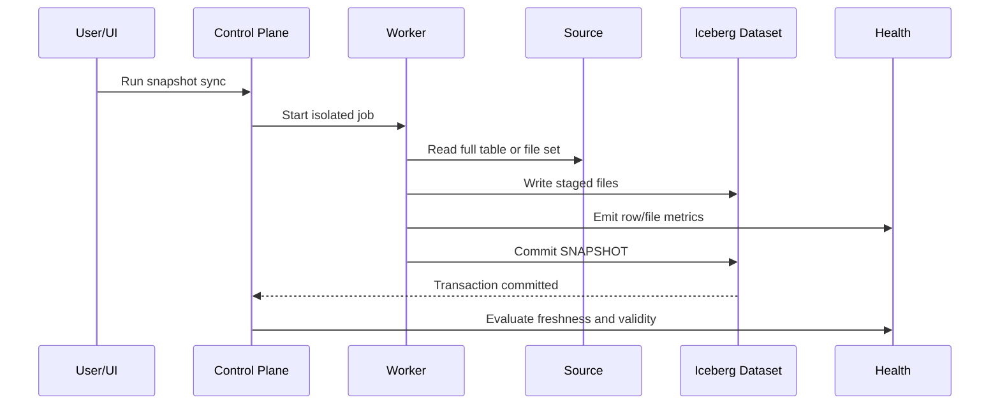
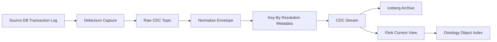
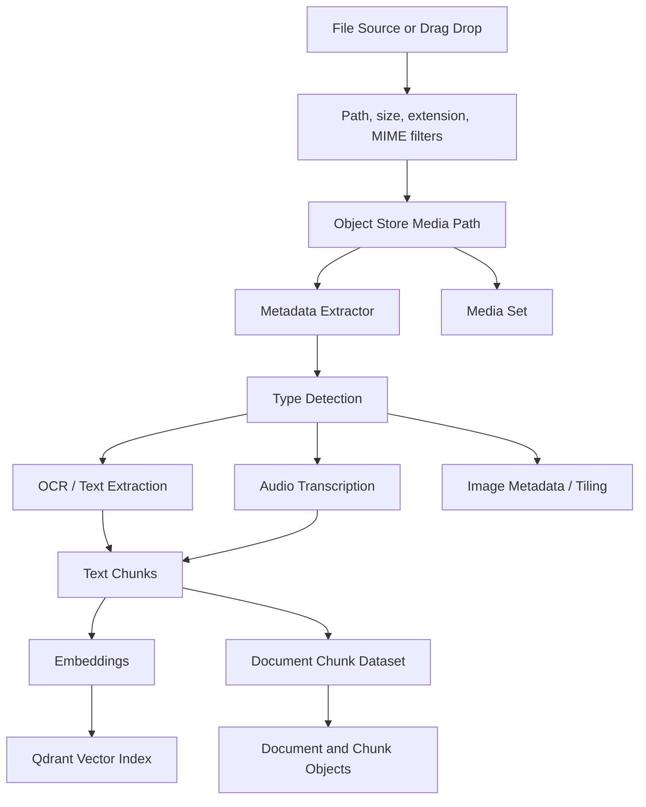
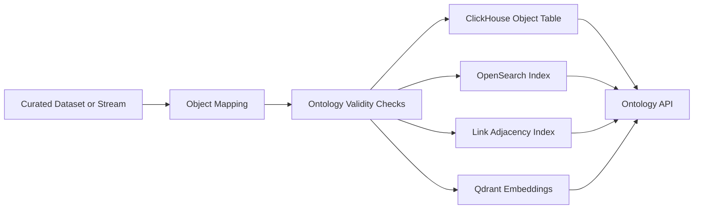

# Palantir-Inspired Self-Hosted Data Platform Architecture

Date: 2026-06-15  
Artifact type: exhaustive technical architecture and implementation plan  
Deployment target: self-hosted enterprise platform  
Ambition level: moonshot platform, but built from operable components  

## 1. Executive Summary

This document specifies a self-hosted data integration, ontology, and data health platform inspired by the architectural patterns of Palantir Foundry, without depending on Palantir proprietary infrastructure. The system must let users create data connectors, ingest structured, semi-structured, and unstructured data, run batch, incremental, streaming, and CDC syncs, materialize data into governed datasets and streams, define ontology object types and link types, and monitor both content validity and operational health.

The core idea is to separate the platform into five planes:

1. **User experience plane**: a Palantir-like operational UI for sources, datasets, pipelines, ontology, lineage, and data health.
2. **Control plane**: metadata, authorization, orchestration, schedules, policies, sync definitions, run history, and governance.
3. **Connector execution plane**: isolated workers and private-network agents that execute connector code and move data.
4. **Data plane**: lakehouse datasets, streaming buffers, media sets, object storage, vector indexes, search indexes, and ontology serving stores.
5. **Observability and health plane**: content validity, operational monitoring, lineage, metrics, traces, logs, alerting, and issue management.

The system should feel like Palantir in concepts and interaction model:

- **Data Connection** for sources, credentials, source exploration, syncs, and agents.
- **Pipeline Builder** for graph-based transforms, batch and streaming execution, previews, tests, and output contracts.
- **Ontology Manager** for object types, properties, link types, actions, functions, and materialization.
- **Data Health** for validity issues, operational health, freshness, monitoring views, alert debug, and resource health.
- **Lineage** for source-to-object traceability, impact analysis, and run-level audit.

The system should be more ambitious than a classical ELT tool. It should not only move data. It should convert enterprise data into a live operational model of reality with objects, links, process state, health, security, and decision lineage.

## 2. Product Goals

### 2.1 Primary Goals

- Allow users to configure connectors to common systems using Palantir-like source types:
  - JDBC databases and warehouses.
  - Filesystems and blob stores.
  - SaaS and business systems through commercial or open-source drivers.
  - REST, GraphQL, OData, LDAP, RSS, SMTP/IMAP, webhooks, and generic connectors.
  - Streaming sources such as Kafka, Kinesis-compatible APIs, MQTT, RabbitMQ, and Pub/Sub-compatible systems.
  - CDC-capable databases through Debezium-compatible log capture.
  - Drag-and-drop user uploads for structured, semi-structured, and unstructured files.
- Store all ingested data in governed platform resources:
  - Structured datasets.
  - Semi-structured datasets.
  - Unstructured datasets.
  - Media sets.
  - Streams.
  - Virtual or external tables where data should remain outside the platform.
- Support sync patterns:
  - Batch snapshot sync.
  - Incremental append sync.
  - Incremental update or merge sync.
  - Streaming sync.
  - Change data capture sync.
  - Media sync.
  - Push-based ingestion.
  - Export and writeback.
- Distinguish clearly between:
  - **Content validity issues**: data violates a declared expectation or contract.
  - **Operational health issues**: data or infrastructure is real, but abnormal, stale, slow, failed, or unhealthy.
- Materialize curated datasets and streams into an ontology:
  - Object types.
  - Properties.
  - Link types.
  - Object sets.
  - Process state objects.
  - Log objects.
  - Document and media references.
  - Action and writeback hooks.
- Provide complete observability:
  - Lineage from connector to dataset to transform to object.
  - Run history.
  - Health status.
  - Data freshness.
  - Metrics, logs, and traces.
  - Alerting and issue workflow.
- Be self-hosted:
  - Run on customer-controlled Kubernetes.
  - No mandatory managed cloud service.
  - Support disconnected and private-network deployments.
  - Use open standards and replaceable components.

### 2.2 Non-Goals

- Do not clone Palantir proprietary software or internal APIs.
- Do not require Palantir enrollment, Foundry APIs, or Palantir-owned infrastructure.
- Do not make all data fully replicated by default. Large tables and sensitive media can remain virtual.
- Do not force all users to code. The primary workflows must be UI-driven, with escape hatches into code.
- Do not make the ontology a static catalog. It must be queryable, permissioned, mutable where allowed, and operationally connected.

## 3. Product Names Used In This Document

The implementation can rename these later, but this plan uses stable names:

- **Atlas UI**: frontend application.
- **Atlas Control Plane**: metadata, orchestration, and policy backend.
- **Atlas Data Connection**: source and connector subsystem.
- **Atlas Pipeline Builder**: pipeline graph and transform subsystem.
- **Atlas Ontology**: semantic object and link subsystem.
- **Atlas Data Health**: validity and operational monitoring subsystem.
- **Atlas Agent**: private-network agent installed near source systems.
- **Atlas Worker**: isolated execution container for connector and transform jobs.
- **Atlas Lake**: Iceberg-backed dataset storage.
- **Atlas Stream**: Kafka-compatible streaming layer.

## 4. Conceptual Model

### 4.1 Palantir-Inspired Concepts

| Concept | Meaning In This Platform |
|---|---|
| Source | A configured connection to an external system. |
| Connector | A driver family or adapter that supports one or more capabilities. |
| Worker | The isolated execution location for connector or pipeline code. |
| Agent | Customer-hosted daemon that reaches private systems and proxies or executes work. |
| Capability | A supported operation such as batch sync, CDC sync, media sync, export, webhook, or source exploration. |
| Dataset | Versioned resource wrapping files or tables in the lakehouse. |
| Stream | Low-latency append log with hot storage and cold archive. |
| Media set | Governed collection of media files and derived media metadata. |
| Pipeline | Directed graph transforming inputs into datasets, streams, media sets, or ontology outputs. |
| Object type | Semantic type representing a real-world entity or event. |
| Link type | Semantic relationship between two object types. |
| Action type | Governed mutation or writeback operation. |
| Data health issue | A user-facing issue caused by validity failure or operational health failure. |
| Monitoring view | Collection of health rules scoped to resources, folders, projects, or lineage. |
| Data lineage | Source-to-output dependency graph with run and transaction provenance. |

### 4.2 Structured, Semi-Structured, And Unstructured Data

| Data Class | Examples | Landing Resource | Processing Path | Ontology Mapping |
|---|---|---|---|---|
| Structured | SQL table, Parquet, CSV with schema, SaaS records | Dataset or stream | Spark, Flink, SQL, Trino | Object types and link types |
| Semi-structured | JSON, XML, logs, API payloads, EDI | Raw dataset or stream | Schema inference, flattening, normalization | Objects, event objects, nested properties |
| Unstructured | PDF, image, audio, video, document archives | Media set or unstructured dataset | Tika, OCR, transcription, chunking, embeddings | Document objects, chunk objects, media references |

## 5. System Architecture

### 5.1 High-Level Architecture



### 5.2 Deployment Topology

The platform should run on Kubernetes and be installable through Helm or Argo CD.



### 5.3 Recommended Technology Stack

| Subsystem | Recommended Technology | Reason |
|---|---|---|
| Kubernetes runtime | Vanilla Kubernetes, OpenShift, or Rancher | Enterprise self-hosted compatibility. |
| GitOps | Argo CD | Repeatable platform deployment. |
| API backend | Go or FastAPI | Go for control-plane performance, FastAPI for rapid admin APIs. |
| UI | React, TypeScript, TanStack Query, React Flow, Monaco | Rich graph and data-building experience. |
| Metadata DB | PostgreSQL HA | Transactional metadata and resource graph state. |
| Object store | Ceph RGW S3 | Self-hosted S3-compatible object storage. |
| Dev object store | MinIO | Lightweight local and development option. |
| Table format | Apache Iceberg | Snapshots, schema evolution, metadata, partitioning, time travel. |
| Catalog | Project Nessie or Iceberg REST Catalog | Git-like branching and lakehouse catalog API. |
| Query engine | Trino | Interactive SQL over Iceberg and external systems. |
| Batch compute | Spark on Kubernetes | Large-scale transforms and table writes. |
| Streaming compute | Flink on Kubernetes | Stateful streaming, windows, CDC handling, low latency. |
| Stream broker | Redpanda or Apache Kafka | Durable Kafka-compatible event log. |
| CDC | Debezium embedded or Kafka Connect | Proven log-based database CDC. |
| Connectors | Airbyte CDK, JDBC, CData drivers, custom SDK | Coverage for business systems and generic sources. |
| Document parsing | Apache Tika, Unstructured, OCRmyPDF, Tesseract | Self-hosted text and metadata extraction. |
| Embeddings | local embedding model, vLLM, Ollama, or customer model endpoint | Self-hosted unstructured search. |
| Vector index | Qdrant | Self-hosted semantic search. |
| Search | OpenSearch | Full-text search over objects, datasets, logs, docs. |
| Analytics serving | ClickHouse | Fast object and health analytics. |
| Graph index | PostgreSQL recursive CTE initially, later JanusGraph or custom adjacency store | Start operable, scale when link traversal needs demand it. |
| Identity | Keycloak | Self-hosted OIDC and SAML integration. |
| Authorization | OPA and SpiceDB | Policy-as-code plus relationship-based authorization. |
| Secrets | Vault | Credential isolation, rotation, audit. |
| Observability | OpenTelemetry, Prometheus/Mimir, Loki, Tempo | Metrics, logs, traces, alerts. |
| Lineage | OpenLineage events, Marquez-compatible store, custom lineage UI | Open lineage standard plus product-specific graph. |
| Data quality | Great Expectations or Soda Core plus custom validity engine | Declarative checks, extensible validation. |

## 6. User Interface Architecture

### 6.1 UI Principles

The UI should be dense, operational, and resource-oriented. It should feel like an enterprise command surface, not a marketing dashboard.

UI principles:

- Left sidebar with major applications.
- Resource tree for projects, folders, sources, datasets, pipelines, object types, monitoring views.
- Main canvas for graph-heavy workflows.
- Right details panel for configuration, permissions, lineage, schema, run history, and health.
- Split views for data preview, schema, issues, and logs.
- Strong use of status badges, resource icons, tabs, breadcrumbs, and diff views.
- Every visible resource should expose:
  - Overview.
  - Configuration.
  - Schema.
  - Runs.
  - Lineage.
  - Health.
  - Permissions.
  - Audit.

### 6.2 Applications

#### 6.2.1 Data Connection

User workflows:

- Create source.
- Select connector type.
- Select worker mode.
- Configure network path.
- Configure credentials.
- Test connection.
- Explore source.
- Create sync.
- Preview output.
- Run or schedule sync.
- Inspect runs and failures.
- Add monitors.

Screens:

- Connector gallery.
- Source overview.
- Connection settings.
- Credentials tab.
- Egress and agent tab.
- Exploration tab.
- Syncs tab.
- Webhooks tab.
- Exports tab.
- Health tab.
- Audit tab.

#### 6.2.2 Pipeline Builder

User workflows:

- Add dataset, stream, media set, or source input.
- Add transform nodes.
- Preview every node.
- Validate schema.
- Define output dataset, stream, media set, object type, or link type.
- Define expectations.
- Run unit tests.
- Publish pipeline.
- Schedule pipeline.
- Inspect build graph and failed runs.

Screens:

- Graph canvas.
- Node configuration side panel.
- Data preview bottom drawer.
- Schema diff panel.
- Unit tests panel.
- Output contracts panel.
- Build settings panel.
- Branches and proposals panel.

#### 6.2.3 Ontology Manager

User workflows:

- Create object type.
- Map backing dataset or stream.
- Select primary key.
- Add properties.
- Define link type.
- Configure materialization.
- Add object search settings.
- Add media reference properties.
- Add action types.
- Add permissions.
- Publish ontology version.

Screens:

- Ontology graph.
- Object type detail.
- Link type detail.
- Property editor.
- Materialization tab.
- Actions tab.
- Object preview.
- Branch/version diff.
- Impact analysis.

#### 6.2.4 Data Health

User workflows:

- See current platform health.
- Separate content validity from operational health.
- Create monitoring view.
- Add validity checks.
- Add operational monitors.
- Inspect alerts.
- Snooze alerts.
- Create remediation ticket.
- Navigate to lineage and runs.

Screens:

- Global health overview.
- Monitoring views.
- Content validity issues.
- Operational health alerts.
- Alert debug page.
- Resource health profile.
- SLA and freshness dashboard.
- Issue workflow board.

#### 6.2.5 Lineage

User workflows:

- Trace data from source to object.
- Trace object back to source transaction.
- Find downstream impacts of schema changes.
- Debug failed pipeline.
- Understand which systems contribute to one property.

Screens:

- Interactive lineage graph.
- Run-level lineage.
- Column/property lineage.
- Object lineage.
- Schema evolution timeline.
- Impact analysis.

## 7. Data Connection Subsystem

### 7.1 Connector Taxonomy

| Connector Family | Examples | Capabilities |
|---|---|---|
| JDBC databases | PostgreSQL, MySQL, SQL Server, Oracle, Db2, MariaDB | batch, incremental, CDC, exploration, table export |
| Warehouses | Snowflake, BigQuery-compatible, Redshift, Databricks SQL, Teradata | batch, virtual table, query pushdown, export |
| Blob stores | S3, Ceph, MinIO, Azure Blob-compatible, GCS-compatible | file sync, media sync, virtual tables, export |
| Filesystems | SFTP, FTPS, SMB, NFS, local directory through agent | file sync, media sync, export |
| SaaS systems | Salesforce, ServiceNow, Jira, GitHub, HubSpot, Workday-like systems | batch, incremental, webhooks, export where supported |
| ERP systems | SAP, NetSuite, Dynamics, Oracle Fusion | batch, incremental, driver-based sync, writeback |
| REST and HTTP | REST, GraphQL, OData, custom APIs | webhooks, external transforms, batch via code |
| Directory | LDAP, Active Directory | batch, incremental where possible |
| Feeds | RSS, Atom, email inboxes | batch, incremental append |
| Streaming | Kafka, Redpanda, MQTT, RabbitMQ, NATS, Pub/Sub-compatible | streaming sync, streaming export |
| CDC | Debezium-supported databases | CDC stream, backfill, key-by resolution |
| Generic | arbitrary private system | use-in-code, compute module, custom sync |
| Upload | user drag-and-drop | batch ingest, media ingest, schema inference |

### 7.2 Connector Capability Matrix

Every connector definition must declare supported capabilities.

| Capability | Description | Target Resource |
|---|---|---|
| `explore` | Browse tables, files, topics, schemas, endpoints, sample rows. | UI preview only |
| `batch_sync` | Periodic extract into dataset. | Dataset |
| `incremental_sync` | Extract only new or changed records. | Dataset |
| `streaming_sync` | Continuous source-to-stream ingestion. | Stream |
| `cdc_sync` | Log-based row change ingestion with primary key, order, and deletion metadata. | Stream |
| `media_sync` | Import media files into media set. | Media set |
| `file_export` | Export dataset files to external system. | External file system |
| `table_export` | Export rows to external database or SaaS table. | External table |
| `streaming_export` | Export stream to external topic. | External stream |
| `webhook` | Make structured HTTP requests from actions or functions. | External API |
| `virtual_table` | Register external table without copying data. | Virtual dataset |
| `virtual_media` | Register external media without copying data. | Virtual media set |
| `use_in_code` | Make connector available to custom Python, TypeScript, or container code. | Code execution |

### 7.3 Worker Modes

The system should support three modes, but recommend the first two.

| Worker Mode | Compute Location | Network Path | Credential Handling | Use Case |
|---|---|---|---|---|
| Direct worker | Platform Kubernetes | Worker connects directly to source | Vault decrypts into worker runtime | Internet or platform-reachable systems |
| Agent proxy worker | Platform Kubernetes | Worker tunnels through Atlas Agent | Vault decrypts into worker runtime | Private systems reachable from agent |
| Agent worker | Agent host or nearby runtime | Agent executes extract locally | Agent retrieves scoped credential material | Legacy or high-volume local file filtering |

### 7.4 Source Resource Model

```yaml
source:
  id: src_01HY...
  name: Production SAP HANA
  connector_id: connector.sap_hana
  project_id: project_supply_chain
  worker_mode: agent_proxy
  network_routes:
    - route_id: route_private_sap
      type: agent_proxy
      agent_pool_id: agent_pool_eu_factory
      host_patterns:
        - sap-prod.internal.example.com:443
  credentials:
    credential_ref: vault://atlas/sources/src_01HY/main
    auth_type: username_password
    rotation_policy_id: rotate_quarterly
  capabilities:
    - explore
    - batch_sync
    - incremental_sync
    - use_in_code
  export_controls:
    enabled: true
    allowed_markings:
      - INTERNAL
      - SUPPLY_CHAIN
  ownership:
    owner_group: supply_chain_data_engineering
    steward_group: supply_chain_domain
  created_at: "2026-06-15T10:00:00Z"
```

### 7.5 Connector Definition Model

```yaml
connector_definition:
  id: connector.postgresql
  display_name: PostgreSQL
  family: jdbc_database
  driver:
    type: jdbc
    image: registry.local/atlas/connectors/postgresql:16
  supported_worker_modes:
    - direct_worker
    - agent_proxy_worker
    - agent_worker
  supported_auth:
    - username_password
    - client_certificate
    - vault_dynamic_database_credential
  capabilities:
    explore:
      status: ga
    batch_sync:
      status: ga
    incremental_sync:
      status: ga
      cursor_types:
        - monotonically_increasing_column
        - updated_at_timestamp
    cdc_sync:
      status: ga
      engine: debezium
    table_export:
      status: beta
    use_in_code:
      status: ga
  config_schema:
    required:
      - host
      - port
      - database
    optional:
      - sslmode
      - connection_timeout_seconds
      - statement_timeout_seconds
```

## 8. Sync Semantics

### 8.1 Batch Snapshot Sync

Batch snapshot sync replaces the target dataset view with a complete new result.

Use for:

- Small or moderate tables.
- Source systems without reliable incremental keys.
- File mirrors where all files are expected to represent the current state.
- Backfills.
- Reconciliation snapshots.

Storage behavior:

- Write files to staging path.
- Validate schema and content.
- Commit one Iceberg snapshot transaction.
- If sync fails, abort staged files and leave previous dataset version untouched.



### 8.2 Incremental Append Sync

Incremental append sync adds new immutable records or files.

Use for:

- Event tables.
- Append-only logs.
- New files in landing folders.
- API records with created-at cursor.

Rules:

- Cursor must be persisted in sync state.
- Output transaction type is APPEND.
- No existing file should be overwritten.
- Downstream pipelines can run incrementally.
- Duplicate handling must be explicit.

Cursor options:

- Monotonically increasing numeric column.
- Timestamp column.
- API cursor token.
- File path plus hash.
- Topic offset.
- Source-specific watermark.

### 8.3 Incremental Update Or Merge Sync

Incremental update sync ingests new and changed records, then merges into current view.

Use for:

- Mutable source tables.
- Files that can change after initial landing.
- SaaS APIs with updated-at semantics.

Rules:

- Requires primary key.
- Requires update ordering column or version.
- Output can be Iceberg MERGE or UPDATE transaction.
- Downstream incremental processing is harder and may need full recomputation for affected tables.
- Content validity checks should run before merge commit.

### 8.4 Streaming Sync

Streaming sync continuously reads records from a message source into a platform stream.

Use for:

- Kafka topics.
- MQTT sensor feeds.
- RabbitMQ queues.
- Pub/Sub-compatible systems.
- Websocket feeds.

Rules:

- Each stream has schema, partitions, hot retention, and cold archive.
- Use at-least-once ingestion by default.
- Use exactly-once processing inside Flink where configured.
- Archive stream records to Iceberg every few minutes or by size threshold.
- Emit stream lag and throughput metrics continuously.

### 8.5 CDC Sync

CDC sync captures database log changes and writes changelog-shaped records to a stream.

Required metadata:

- Primary key columns.
- Ordering column or log sequence number.
- Operation type.
- Deletion flag.
- Source timestamp.
- Capture timestamp.
- Transaction id where available.

CDC flow:



Backfill strategy:

1. Run a batch snapshot sync to create historical base table.
2. Start CDC capture from a known offset.
3. Convert snapshot records into create events.
4. Union snapshot events and CDC stream.
5. Resolve by primary key and ordering.
6. Materialize current view into dataset and ontology.

### 8.6 Media Sync

Media sync imports files into a media set and creates structured metadata records.

Use for:

- PDFs.
- Images.
- Audio.
- Video.
- CAD files.
- Scanned forms.
- Geospatial imagery.
- Medical imaging, if allowed by deployment compliance.

Media flow:



## 9. Dataset, Stream, And Media Storage

### 9.1 Dataset Model

Datasets are versioned resources backed by Iceberg tables or object-store file collections.

Dataset fields:

```yaml
dataset:
  id: ds_01...
  name: raw_salesforce_accounts
  data_class: structured
  storage_kind: iceberg_table
  catalog: atlas_lake
  namespace: project_sales.raw
  table: raw_salesforce_accounts
  branch: main
  schema_id: schema_01...
  current_transaction_id: txn_01...
  source_sync_id: sync_01...
  markings:
    - INTERNAL
    - SALES
  retention_policy_id: retention_default_7y
  owner_group: sales_data_engineering
```

### 9.2 Dataset Transaction Types

| Transaction Type | Meaning | Downstream Impact |
|---|---|---|
| SNAPSHOT | Replace current view with complete new data | Simple, often full rebuild |
| APPEND | Add immutable new data | Supports incremental downstream builds |
| UPDATE | Add or replace existing records/files | May force downstream recompute |
| DELETE | Remove data from current view | Requires retention and audit care |
| MERGE | Upsert or delete by primary key | Best for Iceberg current-state tables |

### 9.3 Stream Model

```yaml
stream:
  id: stream_01...
  name: machine_sensor_events
  broker_topic: atlas.project_factory.machine_sensor_events.v1
  schema_id: schema_02...
  partitions: 12
  hot_retention: 72h
  cold_archive:
    enabled: true
    dataset_id: ds_stream_archive_01
    interval: 5m
  delivery_semantics:
    ingestion: at_least_once
    processing: exactly_once
  watermark:
    field: event_timestamp
    lateness: 10m
```

### 9.4 Media Set Model

```yaml
media_set:
  id: media_01...
  name: supplier_contracts
  object_store_prefix: s3://atlas-media/project_legal/supplier_contracts/
  allowed_media_types:
    - application/pdf
    - image/png
    - image/jpeg
  metadata_dataset_id: ds_media_supplier_contracts_metadata
  extraction_pipeline_id: pipe_contract_text_extraction
  default_ontology_object_type: SupplierDocument
```

## 10. Pipeline Builder Architecture

### 10.1 Pipeline Graph Model

Pipelines are directed acyclic graphs for batch and bounded transforms, and directed job graphs for streaming transforms.

Node types:

- Source input.
- Dataset input.
- Stream input.
- Media set input.
- Virtual table input.
- Select.
- Filter.
- Join.
- Union.
- Aggregate.
- Deduplicate.
- Cast.
- Parse JSON.
- Parse XML.
- Flatten.
- Explode.
- Key-by.
- Window.
- Enrich.
- LLM or model inference.
- OCR or text extraction.
- Chunk text.
- Embed text.
- Geospatial transform.
- Validity check.
- Dataset output.
- Stream output.
- Media set output.
- Object type output.
- Link type output.

### 10.2 Pipeline Resource Model

```yaml
pipeline:
  id: pipe_01...
  name: Account Mastering Pipeline
  project_id: project_sales
  mode: batch
  graph_version: 17
  inputs:
    - dataset_id: ds_raw_salesforce_accounts
    - dataset_id: ds_raw_erp_customers
  outputs:
    - dataset_id: ds_curated_customer_master
    - object_type_id: ot_customer
  execution_engine: spark
  schedule:
    type: on_input_update
  expectations:
    - expectation_id: exp_customer_pk
    - expectation_id: exp_min_row_count
```

### 10.3 Pipeline Compilation

The UI graph compiles into an intermediate representation.

Compilation stages:

1. Validate graph structure.
2. Infer schemas at every node.
3. Resolve data types.
4. Detect invalid operations.
5. Decide execution engine.
6. Generate SQL, Spark, Flink, or Python plan.
7. Generate lineage plan.
8. Generate resource access plan.
9. Create reproducible job package.
10. Submit to orchestrator.

### 10.4 Execution Engines

| Workload | Engine |
|---|---|
| Small interactive preview | DuckDB, DataFusion, or Trino |
| Large batch transform | Spark |
| Streaming transform | Flink |
| SQL exploration | Trino |
| Document processing | Python/Ray workers |
| Model inference | Ray or dedicated model service |
| Custom container | Kubernetes job or long-running compute module |

### 10.5 Pipeline Branching

The platform should support safe edits through branches.

Branch behavior:

- Pipeline drafts are isolated from production.
- Dataset branches use Nessie or Iceberg branch/tag where feasible.
- Users can preview schema and sample outputs before merge.
- Proposals show graph diff and schema diff.
- Merge requires passing tests, expectations, and permissions.

## 11. Content Validity

### 11.1 Definition

Content validity issues occur when data violates declared expectations about the data itself.

Examples:

- Required column missing.
- Column type changed unexpectedly.
- Primary key is null.
- Primary key is duplicated.
- Enum contains unsupported value.
- Value is outside valid business domain.
- JSON is malformed.
- XML fails schema validation.
- PDF has no extractable text when expected.
- Media file MIME type does not match extension.
- Foreign key cannot resolve.
- Required relationship is missing.
- Record violates a business rule.

### 11.2 Validity Contract Types

| Contract Type | Examples |
|---|---|
| Schema contract | required columns, field types, nested structures |
| Primary key contract | uniqueness, non-null, stable key |
| Row count contract | min, max, percent change |
| Nullability contract | required fields, max null percentage |
| Domain contract | allowed values, regex, numeric range |
| Referential contract | object link must resolve |
| Temporal contract | timestamps within expected range |
| File contract | MIME type, file size, path pattern, checksum |
| Semi-structured contract | JSON schema, XML schema, required paths |
| Media contract | OCR success, page count, image dimensions |
| Ontology contract | object property completeness, link cardinality |
| Business rule contract | cross-column and cross-object constraints |

### 11.3 Validity Contract Model

```yaml
validity_contract:
  id: vc_01...
  name: Customer Master Validity
  resource_id: ds_curated_customer_master
  enforcement_mode: block_publish
  checks:
    - type: primary_key
      columns:
        - customer_id
      severity: severe
    - type: not_null
      columns:
        - customer_name
        - source_system
      severity: moderate
    - type: enum
      column: customer_status
      allowed:
        - active
        - inactive
        - suspended
      severity: moderate
    - type: referential_integrity
      column: account_owner_id
      target_object_type: Employee
      target_property: employee_id
      severity: severe
```

### 11.4 Enforcement Modes

| Mode | Behavior |
|---|---|
| observe_only | Record issue but do not block. |
| warn_on_publish | Publish data, show warning. |
| quarantine_invalid_records | Publish valid records, isolate invalid records. |
| block_publish | Abort transaction or pipeline output. |
| require_approval | Publish only after owner approval. |

### 11.5 Validity Issue Model

```yaml
data_health_issue:
  id: issue_01...
  category: content_validity
  severity: severe
  status: open
  title: Duplicate customer_id values detected
  resource_id: ds_curated_customer_master
  check_id: vc_01.check.primary_key
  run_id: run_01...
  transaction_id: txn_01...
  sample_records_uri: s3://atlas-health/issues/issue_01/samples.parquet
  failure_count: 128
  first_seen_at: "2026-06-15T11:00:00Z"
  last_seen_at: "2026-06-15T11:00:00Z"
  owner_group: sales_data_engineering
  remediation:
    assigned_to: null
    notes: []
```

## 12. Operational Health

### 12.1 Definition

Operational health issues occur when the data may be real, but something about the system, timing, volume, infrastructure, or observed behavior is abnormal or unhealthy.

Examples:

- Sync failed.
- Sync exceeded max duration.
- Stream lag is too high.
- Agent is offline.
- Worker pod was OOMKilled.
- Dataset is stale.
- Source API rate limit is rising.
- Records per hour dropped unexpectedly.
- Business value is anomalous but possible.
- CDC offset has not advanced.
- Object index is behind dataset transaction.
- Freshness SLA missed.
- Query p95 latency degraded.
- Resource disk or memory is near limit.

### 12.2 Operational Monitor Types

| Monitor Type | Example |
|---|---|
| Job status | sync run failed 3 times |
| Build duration | p95 build duration above 30 minutes |
| Freshness | object type not indexed in 2 hours |
| Lag | stream consumer lag above 1 million records |
| Throughput | events per minute below expected floor |
| Volume anomaly | row count dropped by 40 percent |
| Value anomaly | average unit price 5 sigma above baseline |
| Agent health | agent heartbeat missing for 5 minutes |
| Connector health | REST 429 or 5xx rate above threshold |
| Resource health | CPU, memory, disk, queue, thread pool |
| Index health | ontology or search index behind latest transaction |
| Lineage health | downstream output not rebuilt after upstream change |

### 12.3 Operational Monitor Model

```yaml
operational_monitor:
  id: mon_01...
  name: Salesforce Account Sync Freshness
  resource_scope:
    type: dataset
    resource_id: ds_raw_salesforce_accounts
  metric: dataset.freshness.age_minutes
  rule:
    operator: ">"
    threshold: 90
    consecutive_windows: 2
  severity: high
  notifications:
    - channel: email
      target: sales_data_engineering
    - channel: webhook
      target: pagerduty_sales_data
  snooze_policy:
    max_duration: 24h
    requires_reason: true
```

### 12.4 Health States

All resources should expose a normalized health state.

| State | Meaning |
|---|---|
| healthy | No active material issue. |
| repairing | System is recovering automatically. |
| warning | Degraded or trending toward failure. |
| error | User-visible or data-impacting failure. |
| unknown | Missing telemetry or insufficient permission. |

### 12.5 Data Health UI Separation

The UI must make the distinction unavoidable:

- **Content Validity** tab:
  - contract failures.
  - schema issues.
  - invalid records.
  - quarantine.
  - failed expectations.
- **Operational Health** tab:
  - failed jobs.
  - stale datasets.
  - stream lag.
  - agent health.
  - abnormal values.
  - resource saturation.

## 13. Ontology Architecture

### 13.1 Ontology Purpose

The ontology is the operational semantic layer. It converts technical datasets into business entities, events, relationships, state, and actions.

It should model reality, not source systems.

Examples:

- Customer, not Salesforce Customer and ERP Customer separately.
- Order, not SAP Order Row.
- Machine, Sensor, Plant, WorkOrder, Shipment, Supplier, Invoice, Contract.
- Document and DocumentChunk for unstructured data.
- Alert and ProcessLog for operational state.

### 13.2 Ontology Resource Model

```yaml
object_type:
  id: ot_customer
  api_name: Customer
  display_name: Customer
  description: Unified customer across CRM, ERP, and support systems.
  primary_key:
    property: customer_id
    type: string
  properties:
    - api_name: customer_id
      type: string
      required: true
      source_column: customer_id
    - api_name: name
      type: string
      source_column: customer_name
    - api_name: status
      type: string
      enum: CustomerStatus
    - api_name: last_updated
      type: timestamp
  backing:
    resource_type: dataset
    resource_id: ds_curated_customer_master
    materialization_mode: incremental
  indexes:
    search:
      enabled: true
      fields:
        - name
        - customer_id
    vector:
      enabled: false
  permissions:
    read_policy: policy_customer_read
    edit_policy: policy_customer_edit
```

### 13.3 Link Type Model

```yaml
link_type:
  id: lt_customer_order
  api_name: CustomerPlacedOrder
  display_name: Customer placed order
  from_object_type: Customer
  to_object_type: Order
  cardinality: one_to_many
  backing:
    type: derived
    from_property: Customer.customer_id
    to_property: Order.customer_id
  required: false
```

### 13.4 Object Serving Stores

Use multiple physical indexes behind one ontology API.

| Store | Purpose |
|---|---|
| ClickHouse | Fast filtering, aggregation, object tables, time series summaries. |
| PostgreSQL | Metadata, small object sets, permissions, transactions. |
| OpenSearch | Full-text object search and document search. |
| Qdrant | Semantic search over documents, chunks, and optionally objects. |
| Graph adjacency store | Link traversal, shortest paths, neighborhood expansion. |
| Object store | Large payloads, media references, raw evidence. |

### 13.5 Object Materialization



Materialization modes:

- Snapshot rebuild.
- Incremental append.
- Merge by primary key.
- CDC current-state resolution.
- Streaming low-latency updates.
- Manual backfill.

### 13.6 Process Objects And Log Objects

For process modeling, create:

- A process object type with current state.
- A process log object type with state transitions.
- A link from process object to log entries.

Minimum process log schema:

| Field | Type | Required |
|---|---|---|
| log_id | string | yes |
| process_id | string | yes |
| old_state | string | yes |
| new_state | string | yes |
| timestamp | timestamp | yes |
| is_latest | boolean | optional |
| duration_ms | long | optional |
| path | string or array | optional |
| action_type_id | string | optional |
| owning_application_id | string | optional |

## 14. Actions And Writeback

### 14.1 Action Type Purpose

Actions are governed changes initiated by users, automations, or agents.

Examples:

- Update customer status.
- Approve supplier.
- Assign alert.
- Trigger ERP writeback.
- Create issue in Jira.
- Send message to Slack.
- Re-run sync.
- Quarantine dataset transaction.

### 14.2 Action Type Model

```yaml
action_type:
  id: action_update_customer_status
  api_name: UpdateCustomerStatus
  display_name: Update customer status
  target_object_type: Customer
  inputs:
    - name: customer_id
      type: string
      required: true
    - name: new_status
      type: enum
      enum: CustomerStatus
      required: true
  submission_criteria:
    - expression: "user.hasRole('customer_admin')"
    - expression: "object.status != new_status"
  effects:
    - type: ontology_edit
      object_type: Customer
      property_updates:
        status: input.new_status
    - type: webhook
      source_id: src_customer_mdm_api
      webhook_id: wh_update_status
  audit:
    capture_before_after: true
    require_reason: true
```

### 14.3 Writeback Guarantees

Writebacks must be explicit, governed, audited, and idempotent.

Rules:

- Every writeback requires an action type.
- Every action has an authorization policy.
- Every action records input, caller, time, result, and external response.
- Long-running writebacks use durable workflow execution.
- External side effects require idempotency keys.
- Failed side effects must be retryable or compensatable.
- Sensitive payloads must be redacted in logs.

## 15. Lineage And Provenance

### 15.1 Lineage Levels

| Level | Example |
|---|---|
| Resource lineage | Source -> dataset -> pipeline -> object type |
| Run lineage | Sync run 123 produced transaction 456 |
| Column lineage | `Customer.name` came from `crm.account_name` |
| Object lineage | Customer `C123` came from rows in CRM and ERP |
| Action lineage | User action changed object and wrote back to ERP |
| Issue lineage | Validity issue came from sync run and source table |

### 15.2 Lineage Event Model

```yaml
lineage_event:
  id: lineage_01...
  event_type: dataset.transaction.committed
  run_id: run_01...
  producer:
    resource_type: sync
    resource_id: sync_salesforce_accounts
  inputs:
    - resource_type: source
      resource_id: src_salesforce
      locator: Account
  outputs:
    - resource_type: dataset
      resource_id: ds_raw_salesforce_accounts
      transaction_id: txn_01...
  column_lineage:
    - output: account_id
      inputs:
        - Account.Id
    - output: account_name
      inputs:
        - Account.Name
  timestamp: "2026-06-15T12:00:00Z"
```

### 15.3 Lineage UI Behavior

The lineage graph should support:

- Expand upstream.
- Expand downstream.
- Collapse by project.
- Filter by resource type.
- Show only unhealthy resources.
- Show schema changes.
- Show latest run status.
- Open run logs.
- Open object mapping.
- Open health issue.

## 16. Security And Governance

### 16.1 Identity

Use Keycloak for:

- OIDC.
- SAML integration with enterprise IdPs.
- Groups.
- Service accounts.
- Token exchange.
- Short-lived worker tokens.

### 16.2 Authorization

Use two complementary models:

- OPA for attribute-based and policy-as-code decisions.
- SpiceDB for relationship-based permissions.

Permission dimensions:

- Project.
- Folder.
- Resource.
- Object type.
- Link type.
- Action type.
- Property.
- Row or object-level filter.
- Data marking.
- Purpose or use case.
- Environment.

### 16.3 Data Markings

Every resource can carry markings.

Examples:

- PUBLIC.
- INTERNAL.
- CONFIDENTIAL.
- EXPORT_CONTROLLED.
- HR.
- FINANCE.
- HEALTH.
- CUSTOMER_DATA.
- NATIONAL_SECURITY.

Markings propagate through lineage by default.

Rules:

- Output markings are the union of input markings unless explicitly reduced by authorized declassification.
- External exports require exportable marking configuration.
- Logs and alert payloads must respect markings.
- Search results must filter by authorization.

### 16.4 Secrets

Secrets must:

- Live in Vault.
- Never be stored in PostgreSQL.
- Never appear in logs.
- Be injected into workers only at runtime.
- Be scoped to a source and capability.
- Support rotation.
- Support dynamic credentials where possible.
- Support certificates and custom CAs.

### 16.5 Audit

Audit all:

- Source creation.
- Credential update.
- Connection test.
- Sync creation.
- Sync run.
- Dataset transaction.
- Schema change.
- Validity contract change.
- Monitor change.
- Ontology change.
- Permission change.
- Action execution.
- Export.
- Secret access.

## 17. Observability Architecture

### 17.1 Telemetry Types

| Telemetry | Examples |
|---|---|
| Metrics | rows read, bytes written, lag, duration, failures |
| Logs | connector logs, transform logs, validation logs |
| Traces | source call, worker task, storage write, commit |
| Events | run started, issue opened, object index updated |
| Profiles | CPU, memory, heap, query profile |

### 17.2 Metric Names

Recommended normalized metrics:

- `atlas.sync.run.duration_seconds`
- `atlas.sync.rows_read`
- `atlas.sync.bytes_read`
- `atlas.sync.rows_written`
- `atlas.sync.bytes_written`
- `atlas.sync.failures_total`
- `atlas.stream.consumer_lag_records`
- `atlas.stream.throughput_records_per_second`
- `atlas.dataset.freshness_age_seconds`
- `atlas.dataset.transaction.commit_duration_seconds`
- `atlas.validity.failed_records`
- `atlas.validity.failed_checks`
- `atlas.ontology.index_lag_seconds`
- `atlas.agent.heartbeat_age_seconds`
- `atlas.worker.cpu_usage`
- `atlas.worker.memory_usage`
- `atlas.external.request.errors_total`
- `atlas.external.request.rate_limited_total`

### 17.3 Alert Routing

Alerts route through:

- UI notification.
- Email.
- Slack-compatible webhook.
- PagerDuty-compatible webhook.
- Generic webhook.
- Jira or issue tracker connector.

Rules:

- Critical data validity failures notify data owner and steward.
- Operational agent failures notify platform operations.
- Source rate-limit failures notify connector owner.
- Ontology index failures notify ontology owner and platform operations.
- Business anomalies notify domain owner, not only data engineering.

## 18. Agent Architecture

### 18.1 Agent Responsibilities

The Atlas Agent runs in customer private networks and provides:

- Private source reachability.
- Reverse tunnel to control plane.
- Agent health telemetry.
- Optional local file scanning.
- Optional local execution for thick mode.
- Certificate trust bundle.
- Network policy enforcement.
- Local buffering for disconnected operation.

### 18.2 Agent Security Model

Rules:

- Agent initiates outbound connection only.
- Agent authenticates using short-lived token or mTLS certificate.
- Agent is assigned to an agent pool.
- Agent pool has allowed network destinations.
- Worker requests are scoped to a source and route.
- Agent never receives broad platform credentials.
- Thick mode requires additional approval because secrets may be local.

### 18.3 Agent Modes

| Mode | Description | Recommended |
|---|---|---|
| Proxy mode | Agent tunnels traffic between worker and private source. | Yes |
| File scanner mode | Agent enumerates large file systems and sends manifests. | Yes |
| Worker mode | Agent executes connector jobs locally. | Only for special cases |
| Offline buffer mode | Agent stores events during disconnection and forwards later. | For edge deployments |

## 19. Generic Connectors And Code Escape Hatches

### 19.1 Generic Connector

Generic connectors represent arbitrary external systems. They include:

- Network routes.
- Credentials.
- Certificates.
- Export controls.
- Runtime environment constraints.

They do not need built-in sync capabilities. Instead, they are imported into code.

### 19.2 Code-Based Connectivity

Supported code surfaces:

- Python external transform.
- TypeScript function.
- Python function.
- Long-running compute module.
- Custom container.

Use cases:

- Complex REST pagination.
- Multi-step OAuth.
- Proprietary protocol.
- Vendor-specific SDK.
- Streaming custom consumer.
- Writeback orchestration.

## 20. Drag-And-Drop Uploads

### 20.1 Upload UX

User flow:

1. User selects project and folder.
2. User drags files into upload area.
3. UI shows detected file types.
4. User chooses resource type:
   - Structured dataset.
   - Semi-structured raw dataset.
   - Media set.
5. System previews sample rows or media metadata.
6. User selects schema inference options.
7. User defines validity checks.
8. Upload commits to dataset or media set.
9. Optional pipeline is created for parsing and ontology mapping.

### 20.2 Upload Safety

Upload requirements:

- Virus scanning.
- MIME detection.
- Size limits.
- File count limits.
- Duplicate detection by checksum.
- Quarantine unsupported files.
- Marking selection.
- Owner assignment.
- Audit event.

## 21. Semi-Structured Processing

### 21.1 JSON

JSON handling:

- Store raw JSON files in raw dataset.
- Infer schema from samples.
- Let user pin schema.
- Support flattening and explode.
- Preserve original raw payload.
- Support JSONPath expectations.
- Support malformed-record quarantine.

### 21.2 XML

XML handling:

- Store raw XML in raw dataset.
- Support XSD validation.
- Support XPath extraction.
- Support namespace handling.
- Convert selected paths into tabular columns.
- Preserve raw payload.

### 21.3 Logs

Log handling:

- Support line-delimited JSON.
- Support regex parsing.
- Support grok-like patterns.
- Support timestamp extraction.
- Support severity and service fields.
- Route to stream for high-volume logs.

## 22. Unstructured Processing

### 22.1 Document Object Model

Create object types:

- `Document`
- `DocumentVersion`
- `DocumentChunk`
- `DocumentEntity`
- `DocumentReference`

Example:

```yaml
object_type:
  api_name: Document
  primary_key:
    property: document_id
  properties:
    - document_id
    - filename
    - mime_type
    - checksum
    - page_count
    - language
    - created_at
    - uploaded_by
    - media_reference

object_type:
  api_name: DocumentChunk
  primary_key:
    property: chunk_id
  properties:
    - chunk_id
    - document_id
    - page_start
    - page_end
    - text
    - embedding
```

Links:

- Document has chunks.
- Document references supplier.
- Document mentions product.
- Contract governs purchase order.

### 22.2 Document Processing Pipeline

Steps:

1. MIME detect.
2. Extract metadata.
3. OCR if needed.
4. Extract text.
5. Detect language.
6. Chunk text.
7. Extract entities.
8. Create embeddings.
9. Store chunks.
10. Index full text.
11. Index vectors.
12. Create ontology objects and links.
13. Validate extraction quality.

### 22.3 Extraction Health

Content validity:

- File is corrupt.
- OCR failed.
- Page count is zero.
- Text extraction produced empty output.
- Required document metadata missing.

Operational health:

- OCR queue backlog.
- Extraction duration high.
- Embedding service unavailable.
- Vector index lag.

## 23. Virtual Tables And Data Federation

### 23.1 Purpose

Virtual tables allow the platform to reference external tabular data without copying it.

Use for:

- Very large warehouse tables.
- Regulated data that cannot be replicated.
- Interactive query pushdown.
- Temporary integration.

### 23.2 Virtual Table Model

```yaml
virtual_table:
  id: vt_01...
  name: snowflake_customer_orders
  source_id: src_snowflake
  locator:
    database: PROD
    schema: SALES
    table: CUSTOMER_ORDERS
  schema_id: schema_01...
  update_detection:
    enabled: true
    poll_interval: 1h
  cache_policy:
    mode: metadata_only
```

### 23.3 Virtual Table Limits

Virtual tables should not be used when:

- Low-latency ontology updates are required.
- Source system cannot handle query load.
- Branching and reproducible snapshots are required.
- Downstream transforms need heavy repeated computation.
- Agent proxy is required but query engine cannot route through agent.

## 24. Metadata And Control Plane Schema

### 24.1 Core Tables

PostgreSQL tables:

- `projects`
- `folders`
- `resources`
- `resource_markings`
- `connector_definitions`
- `sources`
- `source_credentials`
- `network_routes`
- `agents`
- `agent_pools`
- `sync_jobs`
- `sync_runs`
- `datasets`
- `dataset_transactions`
- `schemas`
- `schema_versions`
- `streams`
- `media_sets`
- `pipelines`
- `pipeline_versions`
- `pipeline_runs`
- `validity_contracts`
- `validity_check_runs`
- `operational_monitors`
- `health_issues`
- `ontology_versions`
- `object_types`
- `object_properties`
- `link_types`
- `action_types`
- `lineage_events`
- `audit_events`

### 24.2 Resource Identifier Convention

Use opaque IDs with prefixes:

- `proj_`
- `fld_`
- `src_`
- `conn_`
- `sync_`
- `run_`
- `ds_`
- `txn_`
- `stream_`
- `media_`
- `pipe_`
- `ot_`
- `lt_`
- `act_`
- `vc_`
- `mon_`
- `issue_`

## 25. API Design

### 25.1 Source APIs

```http
POST /api/sources
GET /api/sources/{sourceId}
PATCH /api/sources/{sourceId}
DELETE /api/sources/{sourceId}
POST /api/sources/{sourceId}/test
POST /api/sources/{sourceId}/explore
GET /api/sources/{sourceId}/capabilities
GET /api/sources/{sourceId}/syncs
POST /api/sources/{sourceId}/syncs
```

### 25.2 Sync APIs

```http
GET /api/syncs/{syncId}
PATCH /api/syncs/{syncId}
POST /api/syncs/{syncId}/run
POST /api/syncs/{syncId}/pause
POST /api/syncs/{syncId}/resume
GET /api/syncs/{syncId}/runs
GET /api/sync-runs/{runId}
GET /api/sync-runs/{runId}/logs
GET /api/sync-runs/{runId}/metrics
```

### 25.3 Dataset APIs

```http
GET /api/datasets/{datasetId}
GET /api/datasets/{datasetId}/schema
GET /api/datasets/{datasetId}/transactions
GET /api/datasets/{datasetId}/preview
GET /api/datasets/{datasetId}/lineage
GET /api/datasets/{datasetId}/health
POST /api/datasets/{datasetId}/branches
```

### 25.4 Health APIs

```http
GET /api/health/issues
GET /api/health/issues/{issueId}
PATCH /api/health/issues/{issueId}
POST /api/health/issues/{issueId}/snooze
POST /api/health/issues/{issueId}/assign
POST /api/validity-contracts
POST /api/operational-monitors
GET /api/monitoring-views
POST /api/monitoring-views
```

### 25.5 Ontology APIs

```http
GET /api/ontology/object-types
POST /api/ontology/object-types
GET /api/ontology/object-types/{objectTypeId}
PATCH /api/ontology/object-types/{objectTypeId}
POST /api/ontology/link-types
POST /api/ontology/materializations
GET /api/ontology/objects/{objectType}/{objectId}
POST /api/ontology/query
POST /api/ontology/actions/{actionTypeId}/apply
```

## 26. Event Bus

### 26.1 Platform Events

Use Kafka/Redpanda topics for internal events.

Topics:

- `atlas.resource.created`
- `atlas.resource.updated`
- `atlas.source.tested`
- `atlas.sync.run.started`
- `atlas.sync.run.completed`
- `atlas.sync.run.failed`
- `atlas.dataset.transaction.started`
- `atlas.dataset.transaction.committed`
- `atlas.dataset.schema.changed`
- `atlas.pipeline.run.started`
- `atlas.pipeline.run.completed`
- `atlas.validity.check.failed`
- `atlas.health.issue.opened`
- `atlas.health.issue.closed`
- `atlas.ontology.object_type.changed`
- `atlas.ontology.index.updated`
- `atlas.action.executed`
- `atlas.audit.event`

### 26.2 Event Envelope

```json
{
  "event_id": "evt_01",
  "event_type": "atlas.dataset.transaction.committed",
  "occurred_at": "2026-06-15T12:00:00Z",
  "actor": {
    "type": "service",
    "id": "sync-orchestrator"
  },
  "resource": {
    "type": "dataset",
    "id": "ds_01"
  },
  "correlation_id": "run_01",
  "payload": {
    "transaction_id": "txn_01",
    "transaction_type": "APPEND"
  },
  "markings": ["INTERNAL"]
}
```

## 27. Scheduling And Orchestration

### 27.1 Schedule Types

| Schedule Type | Description |
|---|---|
| manual | User starts run. |
| cron | Run on fixed schedule. |
| on_input_update | Run when upstream dataset or stream archive updates. |
| on_source_change | Run when source update detection detects change. |
| event_driven | Run based on platform event. |
| continuous | Streaming job. |
| backfill | Historical run over time range or partitions. |

### 27.2 Orchestrator Responsibilities

- Resolve dependency graph.
- Enforce permissions.
- Acquire source lease.
- Allocate worker.
- Inject secrets.
- Track run state.
- Enforce timeout.
- Handle retries.
- Emit lineage.
- Commit or abort transactions.
- Trigger downstream resources.
- Emit health events.

### 27.3 Run States

| State | Meaning |
|---|---|
| queued | Waiting for resources. |
| starting | Worker is being created. |
| running | Job is active. |
| committing | Output transaction is committing. |
| succeeded | Run completed. |
| failed | Run failed. |
| canceled | User or system canceled. |
| timed_out | Max duration exceeded. |
| retrying | Retry scheduled. |
| paused | Continuous job paused. |

## 28. Failure Handling

### 28.1 Sync Failure Rules

- Failed batch sync must not commit partial data.
- Failed incremental sync must not advance cursor unless commit succeeds.
- Failed CDC sync must resume from last committed offset.
- Failed media sync must not orphan unreferenced media without cleanup.
- Failed export must record external side effect status.
- Failed writeback must be idempotently retryable or require manual remediation.

### 28.2 Quarantine

Quarantine stores invalid data separately.

Quarantine resource contents:

- Invalid records.
- Failure reason.
- Source locator.
- Run id.
- Transaction id.
- Check id.
- Raw payload reference.
- Suggested remediation.

Quarantine is itself governed and searchable.

## 29. Scalability Requirements

### 29.1 Target Scale

Initial target:

- 1,000 sources.
- 10,000 datasets.
- 2,000 streams.
- 5,000 pipelines.
- 1,000 object types.
- 10 billion object records across serving stores.
- 100 TB to 5 PB object storage.
- 50,000 health issues retained historically.
- 1 million lineage events per day.

### 29.2 Scale Strategies

- Partition Iceberg tables by source date or business key.
- Use compaction for small files.
- Use Flink checkpointing for streaming.
- Use ClickHouse partitioning for object serving.
- Use OpenSearch index lifecycle management.
- Use Qdrant collections per domain or object family.
- Use asynchronous materialization.
- Use backpressure-aware worker queues.
- Use resource quotas per project.
- Use agent pools for private-source scaling.

## 30. Performance Requirements

| Operation | Target |
|---|---|
| Source connection test | less than 30 seconds |
| Explore table list | less than 60 seconds for common sources |
| Dataset preview | less than 5 seconds for sampled data |
| Pipeline graph schema inference | less than 10 seconds for typical graph |
| Batch sync startup | less than 60 seconds |
| Streaming ingestion latency | p95 less than 5 seconds where source supports it |
| Ontology object query | p95 less than 300 ms for indexed lookup |
| Object search | p95 less than 1 second |
| Health issue creation after failure | less than 30 seconds |
| Lineage graph first render | less than 3 seconds for local neighborhood |

## 31. Governance Workflows

### 31.1 Source Creation Approval

Steps:

1. User proposes source.
2. Platform validates connector config.
3. Security reviews network route.
4. Data owner approves credentials and markings.
5. Source is activated.
6. Audit event is recorded.

### 31.2 Ontology Change Proposal

Steps:

1. Builder creates object or link changes in branch.
2. Platform computes impact.
3. Tests and validity checks run.
4. Affected app and pipeline owners are notified.
5. Reviewer approves.
6. Ontology version is published.
7. Index materialization runs.

### 31.3 Data Health Issue Lifecycle

States:

- open.
- acknowledged.
- assigned.
- investigating.
- snoozed.
- fixed.
- closed.
- false_positive.
- accepted_risk.

## 32. Implementation Plan

### 32.1 Phase 0: Foundations

Deliver:

- Kubernetes deployment baseline.
- PostgreSQL metadata schema.
- Keycloak integration.
- Vault integration.
- API gateway.
- Resource model.
- Audit log.
- Basic UI shell.

Acceptance criteria:

- User can log in.
- User can create project and folder.
- User can see audit events.
- Backend services deploy through Helm or Argo CD.

### 32.2 Phase 1: Data Connection MVP

Deliver:

- Connector registry.
- Source creation.
- Direct worker execution.
- JDBC PostgreSQL connector.
- REST generic connector.
- S3/Ceph file connector.
- Drag-and-drop upload.
- Connection test.
- Source exploration.
- Batch snapshot sync.
- Dataset preview.

Acceptance criteria:

- User can ingest a PostgreSQL table into Iceberg.
- User can upload CSV and PDF files.
- Failed sync does not commit partial data.
- User can inspect run logs and metrics.

### 32.3 Phase 2: Lakehouse And Pipeline Builder

Deliver:

- Iceberg catalog.
- Dataset transactions.
- Schema registry.
- Pipeline graph UI.
- Basic transforms.
- Spark execution.
- Dataset output.
- Content validity checks.
- Pipeline unit tests.

Acceptance criteria:

- User can build pipeline from raw table to curated table.
- Primary key and row count checks can block publish.
- Lineage shows source -> raw dataset -> pipeline -> curated dataset.

### 32.4 Phase 3: Agents And Private Networks

Deliver:

- Atlas Agent.
- Agent pools.
- Reverse tunnel.
- Agent proxy worker.
- Agent health telemetry.
- Private source routing.

Acceptance criteria:

- Platform can sync from private database reachable only by agent.
- Agent offline creates operational health issue.
- Agent route permissions are enforced.

### 32.5 Phase 4: Streaming And CDC

Deliver:

- Redpanda/Kafka integration.
- Stream resource.
- Streaming sync.
- Debezium CDC.
- Flink processing.
- Stream archive to Iceberg.
- Stream lag monitoring.

Acceptance criteria:

- User can stream Kafka topic into Atlas Stream.
- User can CDC-sync PostgreSQL changes.
- Stream can materialize current-state table.
- Lag alerts show in Data Health.

### 32.6 Phase 5: Media And Unstructured Data

Deliver:

- Media sets.
- Tika metadata extraction.
- OCR pipeline.
- Text chunking.
- Embeddings.
- Qdrant index.
- Document and chunk object types.

Acceptance criteria:

- User can upload PDFs into media set.
- Text extraction creates chunk dataset.
- Semantic search retrieves relevant chunks.
- Document object links to chunks and media reference.

### 32.7 Phase 6: Ontology Manager

Deliver:

- Object type creation.
- Link type creation.
- Property mapping.
- Object materialization.
- Object API.
- Search and graph traversal.
- Object-level permissions.

Acceptance criteria:

- User can map curated customer dataset to Customer object type.
- User can define Customer -> Order link.
- Object query returns authorized objects only.
- Link traversal works in UI.

### 32.8 Phase 7: Data Health And Monitoring Views

Deliver:

- Content validity issue board.
- Operational health monitors.
- Monitoring views.
- Freshness checks.
- Alert debug page.
- Notifications.
- Snoozing.
- Issue assignment.

Acceptance criteria:

- Validity failures and operational failures appear in separate tabs.
- User can create monitoring view for a project.
- Alerts route to email and webhook.
- Alert debug links to run logs and lineage.

### 32.9 Phase 8: Actions And Writeback

Deliver:

- Action type model.
- Submission criteria.
- Ontology edits.
- REST webhook writeback.
- External system writeback audit.
- Idempotency keys.

Acceptance criteria:

- User can define action to update object property.
- User can define action to call external REST API.
- All actions are permissioned and audited.

### 32.10 Phase 9: Enterprise Hardening

Deliver:

- HA deployment.
- Backup and restore.
- Disaster recovery runbooks.
- Resource quotas.
- Multi-tenant isolation.
- Policy packs.
- Performance tuning.
- Security review.

Acceptance criteria:

- Platform can be restored from backup.
- Source credentials rotate without downtime.
- Load tests meet target performance.
- Security tests pass.

## 33. Testing Strategy

### 33.1 Unit Tests

Test:

- API validation.
- Connector config parsing.
- Secret reference handling.
- Schema inference.
- Cursor logic.
- Validity check evaluation.
- Policy decisions.
- Ontology mapping.

### 33.2 Integration Tests

Test with real services:

- PostgreSQL.
- MySQL.
- SQL Server if licensed.
- Oracle if licensed.
- MinIO.
- Redpanda.
- Debezium.
- Spark.
- Flink.
- Trino.
- ClickHouse.
- OpenSearch.
- Qdrant.
- Vault.
- Keycloak.

### 33.3 End-To-End Tests

Scenarios:

- Ingest PostgreSQL table, transform, validate, publish object type.
- Upload PDF, extract text, chunk, embed, search, map to Document objects.
- CDC source updates customer row, ontology object updates.
- Stream sensor records, detect anomaly, create operational health issue.
- Agent goes offline, health alert opens.
- Schema drift occurs, content validity issue blocks publish.
- User without marking permission cannot see protected object.
- Writeback action succeeds and audit record is created.

### 33.4 Failure Tests

Tests:

- Kill worker during sync.
- Kill agent during private sync.
- Expire credential.
- Break source network.
- Send malformed JSON.
- Send duplicate primary keys.
- Force stream lag.
- Fill disk pressure in worker namespace.
- Fail ontology index writer.
- Fail webhook writeback.

## 34. Operational Runbooks

### 34.1 Sync Failure Runbook

1. Open health issue.
2. Inspect run logs.
3. Inspect source connectivity.
4. Inspect worker pod termination reason.
5. Inspect credential access.
6. Inspect source rate limits.
7. Retry if transient.
8. Roll back or quarantine if data invalid.
9. Escalate to source owner if repeated.

### 34.2 Schema Drift Runbook

1. Open schema diff.
2. Identify upstream source change.
3. Determine if change is allowed.
4. If allowed, update schema contract and pipeline.
5. If not allowed, block publish and notify source owner.
6. Re-run validity checks.
7. Publish updated pipeline branch.

### 34.3 Stream Lag Runbook

1. Check source throughput.
2. Check broker partitions.
3. Check consumer lag.
4. Check Flink checkpoint duration.
5. Scale stream partitions or Flink parallelism.
6. Inspect backpressure.
7. Consider dropping non-critical derived jobs.

### 34.4 Ontology Index Lag Runbook

1. Identify object type.
2. Check latest dataset transaction.
3. Check materialization run.
4. Check serving store write errors.
5. Rebuild affected index if necessary.
6. Mark object type degraded until caught up.

## 35. Risk Register

| Risk | Severity | Mitigation |
|---|---|---|
| Connector coverage is weaker than Palantir | High | Use CData/JDBC commercial drivers, Airbyte CDK, custom connector SDK. |
| Ontology serving becomes too slow | High | Use specialized indexes and asynchronous materialization. |
| Policy model becomes too complex | High | Start with project/resource permissions, then add object/property policies. |
| Streaming exactly-once semantics are hard | High | Scope exactly-once to Flink processing, keep ingestion at-least-once. |
| CDC backfills produce ordering bugs | High | Require ordering metadata and replay validation before ontology sync. |
| Small files degrade Iceberg performance | Medium | Add compaction service and write-size controls. |
| Unstructured extraction quality varies | Medium | Track extraction confidence and separate validity from operational backlog. |
| Self-hosted operations are heavy | High | Provide Helm charts, runbooks, health dashboards, and sane defaults. |
| UI scope becomes too large | High | Build resource shell and core workflows first, defer polish. |
| Secrets leak through logs | Critical | Redaction library, structured logging, secret scanners, policy tests. |

## 36. Acceptance Criteria For The Full Platform

The platform is successful when:

- A domain data engineer can create a private source through an agent without platform admin help after network policy approval.
- A non-coding analyst can build a batch pipeline, preview every step, and publish a curated dataset.
- A streaming engineer can configure Kafka or CDC ingestion and monitor lag from the UI.
- A data steward can define content validity contracts and see invalid records quarantined.
- A platform operator can see agent, worker, stream, and index health from one health surface.
- An ontology builder can map datasets and streams into object types and link types.
- An application builder can query objects, links, documents, and semantic chunks from one API.
- A security officer can prove who accessed what, which markings flowed where, and which writebacks happened.
- A user can trace a bad object property back to source system, sync run, transaction, and raw row or payload.

## 37. Final Target State

The final system should be a self-hosted operational data platform where:

- Connectors are not just ingestion scripts, but governed sources with credentials, network paths, capabilities, health, and lineage.
- Datasets are not just files, but versioned, permissioned, contract-checked resources.
- Streams are not just queues, but low-latency operational data resources with archive, schema, lag, and health.
- Media sets are not just object storage prefixes, but searchable, extractable, ontology-linked evidence stores.
- Pipelines are not just code jobs, but graph-modeled, tested, lineage-aware transformations.
- Content validity and operational health are separate, first-class concepts.
- The ontology is not a diagram, but a live semantic API over governed operational reality.
- Every object, link, action, issue, and decision can be traced back to source data and system behavior.

