# Palantir-Inspired Data Connector And Data Health Architecture

Status: architecture draft  
Scope: connection, data transfer, storage, health, ontology mapping, and required technologies.  
Non-goal: detailed UX copy, visual branding, or workflow implementation.

## Source Material

This architecture is inspired by public Palantir Foundry concepts and adapts them into an independent system:

- [Data Connection core concepts](https://www.palantir.com/docs/foundry/data-connection/core-concepts/)
- [Data Connection architecture examples](https://www.palantir.com/docs/foundry/data-connection/architecture/)
- [Batch sync setup](https://www.palantir.com/docs/foundry/data-connection/set-up-sync/)
- [Streaming sync setup](https://www.palantir.com/docs/foundry/data-connection/set-up-streaming-sync/)
- [Foundry datasets](https://www.palantir.com/docs/foundry/data-integration/datasets/)
- [File-based syncs](https://www.palantir.com/docs/foundry/data-connection/file-based-syncs/)
- [Data Health and health checks](https://www.palantir.com/docs/foundry/health-checks/overview/)
- [Monitoring views](https://www.palantir.com/docs/foundry/monitoring-views/overview/)
- [Observability overview](https://www.palantir.com/docs/foundry/observability/overview/)
- [Object types](https://www.palantir.com/docs/foundry/object-link-types/object-types-overview/)
- [Link types](https://www.palantir.com/docs/foundry/object-link-types/link-types-overview/)

## Product Shape

Build a Palantir-like operational data platform with five first-class applications sharing one resource graph:

1. **Data Connection**: sources, credentials, agents, syncs, webhooks, listeners, virtual tables, and exports.
2. **Dataset Studio**: structured, semi-structured, unstructured, stream, and media resources with transaction history.
3. **Lineage**: data movement, transformations, validation, ontology mappings, schedules, and consumers.
4. **Data Health**: content validity, operational health, monitoring views, alert routing, and incident history.
5. **Ontology Manager**: object types, link types, object/link backing datasets, identity rules, and serving indexes.

Use a dark, dense, resource-oriented UI similar in spirit to Foundry: persistent left resource navigation, central graph/detail views, right-side configuration panels, tabs for Overview/Runs/Schema/Health/Lineage/Permissions, and React Flow-style lineage graphs. Use Blueprint.js or a similarly dense enterprise component system.

## North Star

The platform should treat connectors, syncs, datasets, health rules, object types, and links as durable resources rather than background jobs. Every operation produces lineage events, metrics, logs, and immutable transaction metadata.

Key principles:

- **Everything is a resource**: source, sync, dataset, stream, media set, schema, validation rule, monitoring view, object type, link type, agent, credential reference, and policy.
- **Data movement is transactional**: batch and incremental syncs commit dataset transactions; streaming syncs commit offsets and micro-batches; failed runs do not silently produce partial trusted data.
- **Validity and health are separate planes**: content validity asks whether data violates an expected contract; operational health asks whether a resource, pipeline, or observed value is abnormal.
- **Raw data is immutable**: raw landing data is never edited in place. Curated layers, object tables, and indexes are derived and rebuildable.
- **Object graph is backed by data**: object types and link types are semantic views over actual tables, files, streams, media, and identity rules.
- **Use code when point-and-click is insufficient**: no-code connectors cover common cases; generic REST, LDAP, RSS, GraphQL, JDBC, filesystem, and custom code connectors cover everything else.

## Overall Architecture

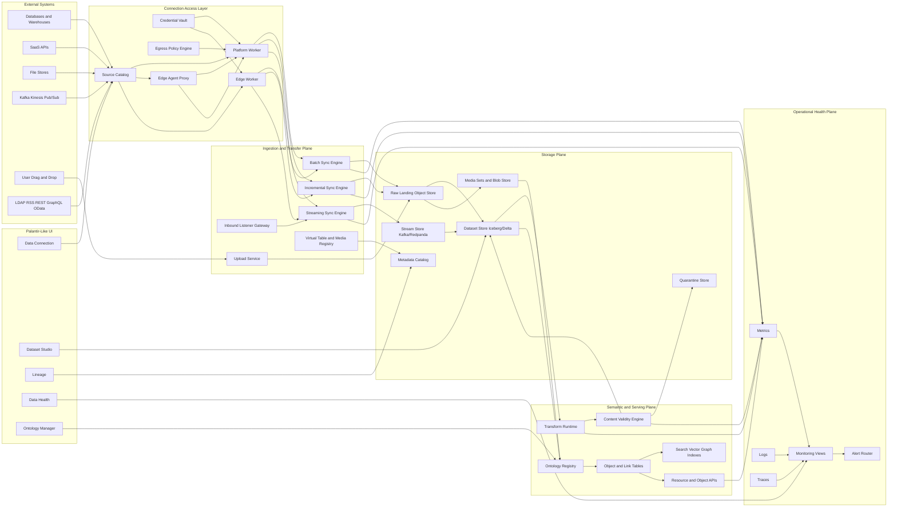

## Control Plane Vs Data Plane

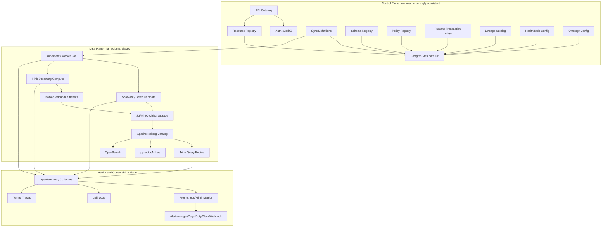

## Core Resource Model

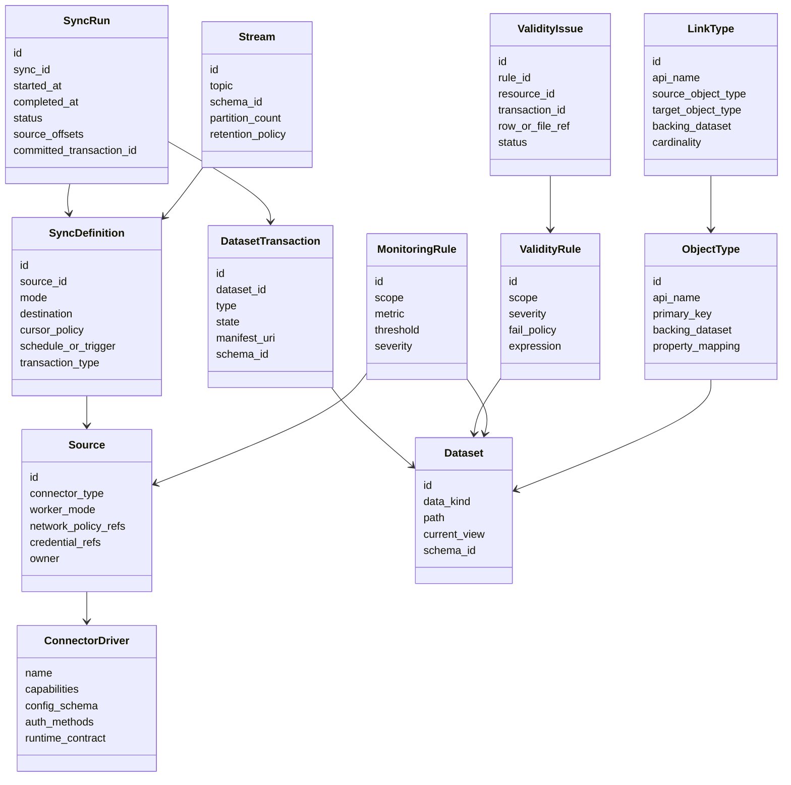

## Connector Runtime Architecture

Mirror Foundry's worker/networking split, but rename it for this platform:

- **Platform worker**: default. Runs connector compute in your Kubernetes environment. Best for cloud/SaaS/public endpoints and private endpoints reachable through controlled egress.
- **Edge agent proxy**: preferred for private networks. Agent runs in the customer network and creates outbound tunnels; compute still runs on the platform worker.
- **Edge worker**: advanced. Agent runs compute close to the source for heavy file filtering, strict data-gravity constraints, or source systems that cannot tolerate remote reads. Use sparingly because it is harder to operate.
- **Direct upload worker**: browser/user upload path for ad hoc files. It creates a source and sync run automatically, so manual uploads still have lineage.

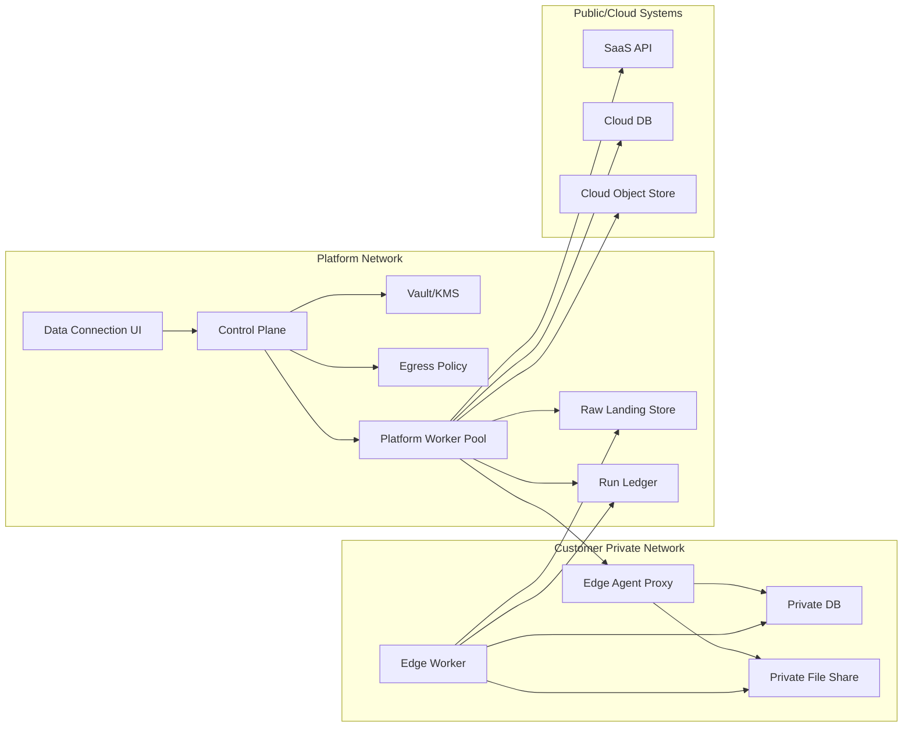

## Connector Driver Catalog

Target driver parity with the Palantir-documented connector families, implemented through open protocols, vendor SDKs, JDBC/ODBC drivers, or licensed third-party connectors. Do not assume Palantir proprietary driver binaries are reusable without a license.

| Family | Examples | Data kinds | Sync modes | Implementation |
| --- | --- | --- | --- | --- |
| SQL/JDBC | PostgreSQL, SQL Server, Oracle, MySQL, DB2, SAP HANA | Structured | Batch, incremental, CDC where supported | JDBC/ODBC, Debezium for CDC, source cursors |
| Warehouses | Snowflake, BigQuery, Redshift, Databricks | Structured | Batch, incremental, virtual tables, exports | Native SDK/JDBC, Iceberg/Delta interop |
| Object stores | S3, Azure Blob/ABFS, GCS, SMB, SFTP | Structured, semi-structured, unstructured | Batch, incremental, media sync | File listing, manifests, object checksums |
| Streaming | Kafka, Kinesis, Pub/Sub, Event Hubs | Semi-structured, binary, structured events | Streaming, streaming export | Kafka protocol, cloud SDKs, schema registry |
| SaaS | Salesforce, NetSuite, SAP, Workday-like, Jira, GitHub | Structured, semi-structured | Batch, incremental, webhooks | Vendor APIs, pagination, rate limit controls |
| Generic API | REST, GraphQL, OData | Semi-structured | Batch via code, webhooks, exports | HTTP client, OAuth2, pagination templates |
| Directory | LDAP, Azure AD, Google Directory | Structured, graph-like | Batch, incremental where supported | LDAP/client SDKs, identity deltas |
| Feeds | RSS, email, webhooks | Semi-structured, unstructured | Batch, listener, streaming | Feed polling, inbound listener gateway |
| Manual upload | CSV, XLSX, JSON, XML, PDF, images, video | All | One-shot batch, append upload | Browser multipart upload, schema inference |
| Virtualization | Snowflake, warehouses, object table formats | Structured, unstructured media | Virtual tables/media | Metadata registration without copying bytes |

## Sync Modes And Transfer Semantics

| Mode | Trigger | Source read behavior | Destination | Transaction/offset behavior | Best use |
| --- | --- | --- | --- | --- | --- |
| Batch snapshot | Schedule or manual run | Read complete selected source | Dataset | Commit `SNAPSHOT`; replace current view | Small/medium tables, stable exports, full refresh |
| Incremental append | Schedule, manual, or event | Read only new records/files by cursor, watermark, path, checksum, or offset | Dataset | Commit `APPEND`; downstream can process deltas | Large append-only sources, event logs, daily files |
| Incremental update/merge | Schedule, manual, CDC micro-batch | Read new and changed rows/files | Dataset/Iceberg table | Commit `UPDATE` or merge; downstream may require full recompute | Mutable source tables, corrections, late arriving changes |
| CDC streaming | Continuous | Read database change log | Stream plus lakehouse table | Persist source LSN/offset; compact by primary key if needed | Low latency DB replication |
| Streaming sync | Continuous | Consume queue/topic | Stream | Commit per offset range; checkpoint partitions | Kafka, Kinesis, Pub/Sub, sensors |
| Push ingestion | External system calls platform | Receive HTTP records | Stream or raw dataset | Validate request, write record batch, return receipt | Custom applications, IoT, systems that can call APIs |
| Listener ingestion | External webhook/email/websocket | Receive nonstandard inbound payload | Stream, media set, compute module | Verify signature/sender, write event, emit lineage | SaaS webhooks, inbound email, telephony |
| Virtual table/media | Query-time | Register external table/media metadata | Catalog resource | No byte copy; health tracks reachability and query latency | Data too large or governed to stay in source |
| Drag and drop | User action | Browser uploads files | Dataset or media set | Commit one upload transaction with manifest | Analyst uploads, ad hoc documents, prototyping |

## Batch And Incremental Transfer

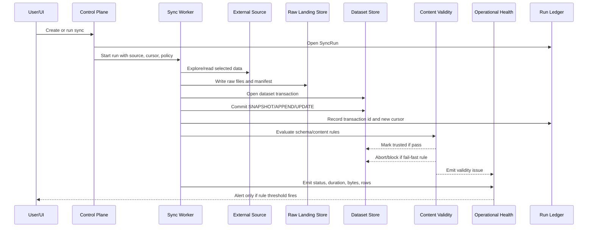

Important behavior:

- A failed batch or incremental sync aborts the dataset transaction and leaves the trusted view unchanged.
- Raw landing data can be retained for forensics even when trusted commit is blocked.
- Incremental APPEND is preferred for file feeds and event-like tables because it gives lower retry cost and end-to-end incremental processing.
- Incremental UPDATE/MERGE is allowed, but it must be marked as non-append-only so downstream pipelines know they may need snapshot recomputation.

## Streaming Transfer

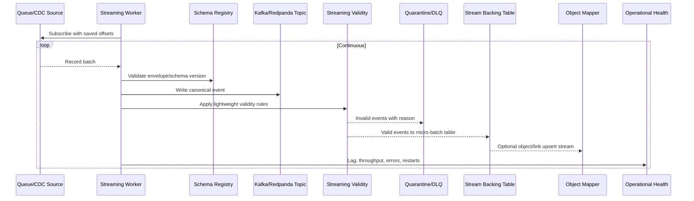

Streaming design rules:

- Keep the original event payload and a canonical envelope: source id, sync id, partition, offset, ingest timestamp, event time, schema version, hash, and security markings.
- Validate cheap rules inline; run expensive semantic checks asynchronously.
- Never drop invalid events. Send them to a quarantine topic/table with the failure reason and replay instructions.
- Persist offsets only after writing records and validity outcomes.
- Support ordered keys for object updates and CDC compaction.

## Storage Architecture

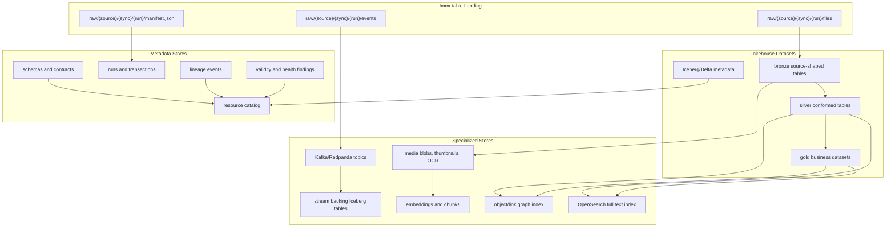

Physical storage map:

| Store | Technology | Contains | Retention |
| --- | --- | --- | --- |
| Metadata DB | PostgreSQL | resources, sync specs, schedules, policy refs, schema refs, health rule configs | Long-lived, backed up |
| Secret store | Vault or cloud KMS/Secrets Manager | encrypted credentials and tokens | Rotated, never copied into logs |
| Raw landing | S3/MinIO/GCS/Azure Blob | immutable source files, event batches, manifests | Policy-based, usually long enough for replay |
| Dataset store | Apache Iceberg or Delta on object storage | structured/semi-structured tables and dataset transactions | Governed by dataset retention |
| Stream store | Kafka/Redpanda/Pulsar | low-latency records, CDC, listener events | Short to medium retention plus lakehouse backing |
| Media store | Object storage plus metadata tables | PDFs, images, video, audio, thumbnails, OCR text, extracted metadata | Usually long-lived |
| Quarantine store | Iceberg tables plus object storage plus DLQ topics | invalid rows/files/events and reasons | Long enough for remediation/replay |
| Search index | OpenSearch | resource search, text search, logs search | Rebuildable from source data |
| Vector index | pgvector or Milvus | document chunks, embeddings, semantic search | Rebuildable from media/text extraction |
| Graph/object index | Neo4j, JanusGraph, or service-owned indexes over Iceberg | object and link traversal acceleration | Rebuildable from object/link tables |
| Metrics store | Prometheus/Mimir | counters, gauges, histograms | 30-180 days hot, archive optional |
| Logs/traces | Loki and Tempo | logs, spans, traces | Operational retention by severity |

## Data Kind Handling

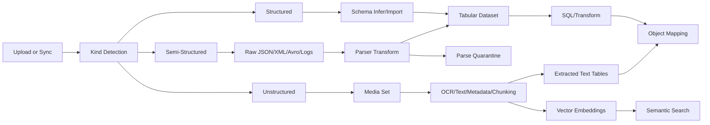

| Data kind | Landing format | Trusted representation | Typical validity checks | Notes |
| --- | --- | --- | --- | --- |
| Structured | Parquet/Avro/CSV snapshots or row batches | Iceberg table with schema | schema, column type, primary key, null percent, allowed values, ranges | Best for SQL, BI, object backing datasets |
| Semi-structured | raw JSON/XML/Avro/text logs | raw dataset plus parsed table | parse success, schema evolution, required fields, event time, nested field rules | Preserve raw payload for replay and schema reparse |
| Unstructured | PDF/image/video/audio/binary files | media set plus extracted metadata/text/chunks | file type, size, checksum, OCR success, required metadata, content classification | Media bytes stay in blob store; derived text/tables power search and ontology |
| Streaming | canonical event envelope plus payload | stream topic plus backing table | envelope schema, key, event time, JSON schema, CDC operation | DLQ/quarantine must be replayable |
| Virtual | external metadata only | virtual table/media resource | reachability, schema drift, permission test, query latency | Does not copy data; still emits health and lineage |

## Dataset Transaction Semantics

Borrow the strongest part of Foundry's dataset model: dataset views are transaction-backed.

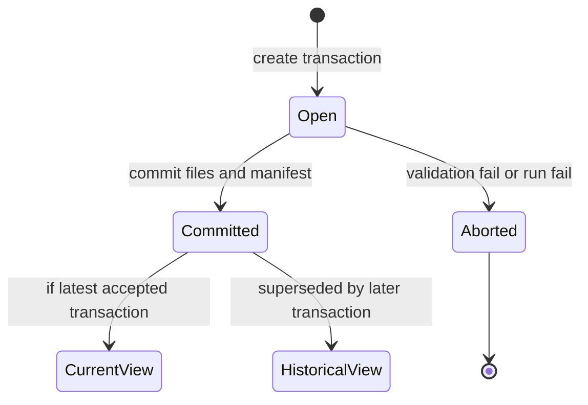

Transaction types:

| Transaction | Meaning | Downstream implication |
| --- | --- | --- |
| `SNAPSHOT` | Replace current view with a new complete set of files | Simple, reliable, more expensive for large data |
| `APPEND` | Add new files/records without changing previous files | Enables true incremental downstream processing |
| `UPDATE` | Add or replace existing files/rows | Needed for mutable sources, weakens incremental guarantees |
| `DELETE` | Remove file/row references from the current view | Used for retention, legal deletion, and corrected datasets |

## Content Validity Vs Operational Health

This split is mandatory. Do not overload one concept with the other.

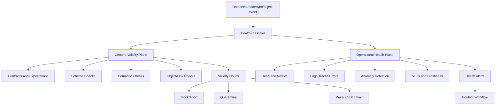

### Content Validity

Content validity means data violates an expected data contract. The data may have arrived successfully, but the content is not acceptable for trusted use.

Examples:

- Missing required column.
- Column type changed from integer to string.
- Primary key is null or duplicated.
- `country_code` not in allowed values.
- Email, identifier, timestamp, or file name fails regex.
- Numeric value outside an agreed domain range.
- JSON/XML cannot be parsed into the expected schema.
- Object primary key is unstable across builds.
- Link points to a non-existent object.
- Required document metadata is missing.
- PDF/image/video cannot be decoded or OCR extraction fails.

Validity actions:

| Severity | Action | Storage outcome |
| --- | --- | --- |
| Info | Commit and record issue | Dataset trusted; issue visible in health |
| Warning | Commit with warning | Dataset trusted but yellow health |
| Error | Commit to untrusted/quarantine branch | Data available for remediation, not default trusted view |
| Critical | Abort transaction or stop stream promotion | Trusted view unchanged; invalid payload in quarantine |

### Operational Health

Operational health means the data may be real, but the system behavior, resource state, or observed metric is abnormal.

Examples:

- Sync failed, timed out, retried too often, or exceeded duration threshold.
- Streaming consumer lag is growing.
- Agent is offline or restarting.
- Source credentials expired.
- Row count dropped 80 percent compared with historical median.
- Data freshness exceeds SLO.
- Dataset file count exploded, causing poor partition health.
- API rate limits throttle syncs.
- Worker CPU/memory is saturated.
- Object API P95 latency crosses threshold.
- Log error rate spikes.

Operational actions:

| Signal | Typical action |
| --- | --- |
| Freshness violation | Alert owner; annotate lineage; keep prior data serving |
| Duration anomaly | Alert pipeline owner; inspect skew, source latency, or code change |
| Volume anomaly | Alert as operational anomaly first; only validity issue if a contract says volume range is invalid |
| Agent/source unavailable | Page connector owner; pause dependent schedules if needed |
| Stream lag | Scale consumers, check source partitions, preserve offset checkpoints |
| Resource saturation | Autoscale or move workload class |

## Data Health Architecture

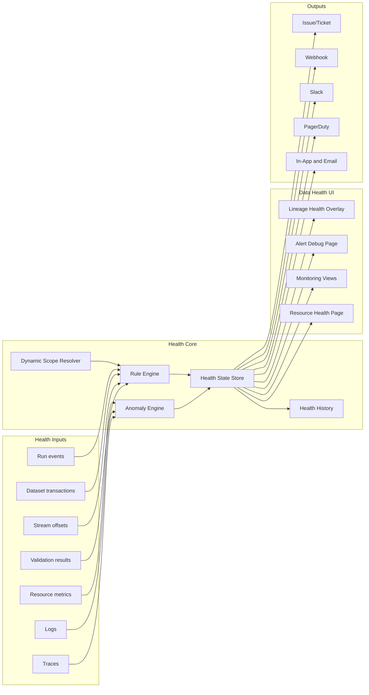

Mandatory health rule families:

| Family | Validity or operational | Example rules |
| --- | --- | --- |
| Status | Operational | sync status, build status, schedule status, job status |
| Time | Operational | time since last update, sync freshness, data freshness, sync duration, build duration |
| Size | Usually operational | row count, file count, file size, transaction size, partition health |
| Schema | Content validity | schema exact match, additions allowed, required columns, column count, column types |
| Content | Content validity | allowed values, regex, primary key, null percentage, numeric range, date range |
| Referential | Content validity | object key stability, link target exists, cardinality, duplicate links |
| Resource | Operational | agent heartbeat, worker saturation, stream lag, API error rate, credential expiry |
| Security/governance | Both | policy violation is validity for trusted data; permission drift is operational/security health |

## Ontology And Object Graph

Objects and links should be generated from backing datasets, not hand-entered into an abstract graph.

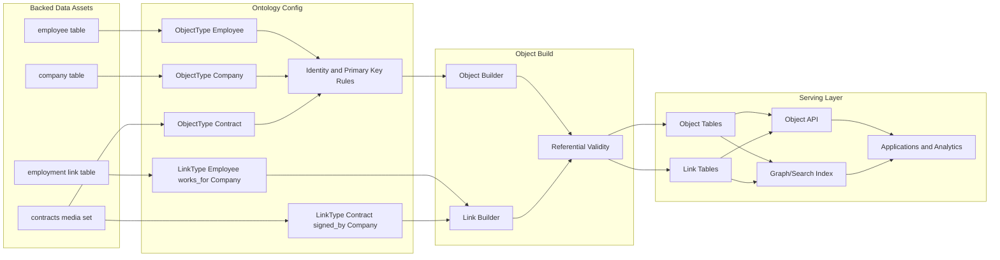

Object storage model:

| Asset | Physical representation | Required metadata |
| --- | --- | --- |
| Object type | table or materialized view over one or more datasets | API name, display name, primary key, property mapping, security policy, source lineage |
| Object instance | row keyed by stable primary key | object id, properties, transaction version, provenance |
| Link type | join/link table between object primary keys | source object type, target object type, cardinality, directionality, backing dataset |
| Link instance | row keyed by source id, target id, link type, optional effective time | provenance, confidence, validity state |
| Object set | saved filter over object type or graph traversal | predicate, permissions, version |
| Derived property | computed property over object/link data | expression, dependencies, refresh policy |

Referential validity rules:

- Object primary keys must be unique, non-null, and stable.
- Many-to-one and one-to-one links must respect cardinality.
- Link rows must resolve both endpoints unless configured as soft links.
- Link tables need effective time if relationships are temporal.
- Object/link build outputs must store source row/file references for traceability.

## Lineage And Data Transfer Trace

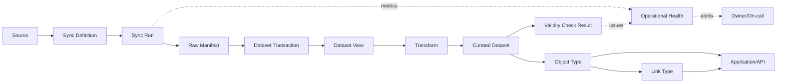

Every node and edge should be queryable. A user should be able to start from an alert and navigate to:

- failing rule,
- affected resource,
- source connector,
- last successful transaction,
- exact files/rows/events affected,
- downstream datasets,
- object types and links impacted,
- applications consuming those objects.

## UI Information Architecture

```mermaid
flowchart TB
    Shell["Platform Shell"]
    Shell --> Compass["Resource Explorer"]
    Shell --> DataConnection["Data Connection"]
    Shell --> DatasetStudio["Dataset Studio"]
    Shell --> Lineage["Lineage"]
    Shell --> DataHealth["Data Health"]
    Shell --> OntologyManager["Ontology Manager"]
    Shell --> Admin["Admin and Policy"]

    DataConnection --> Sources["Sources"]
    DataConnection --> Syncs["Syncs"]
    DataConnection --> Agents["Agents"]
    DataConnection --> Webhooks["Webhooks"]
    DataConnection --> Listeners["Listeners"]

    DatasetStudio --> Preview["Preview"]
    DatasetStudio --> Schema["Schema"]
    DatasetStudio --> History["Transactions"]
    DatasetStudio --> Files["Files/Media"]
    DatasetStudio --> HealthTab["Health"]

    DataHealth --> Monitoring["Monitoring Views"]
    DataHealth --> ValidityIssues["Validity Issues"]
    DataHealth --> OpsAlerts["Operational Alerts"]
    DataHealth --> AlertDebug["Alert Debug"]

    OntologyManager --> Objects["Object Types"]
    OntologyManager --> Links["Link Types"]
    OntologyManager --> Mappings["Backing Data Mappings"]
    OntologyManager --> ObjectHealth["Object/Link Health"]
```

Key UI tabs per resource:

| Resource | Tabs |
| --- | --- |
| Source | Overview, Config, Credentials, Network, Capabilities, Syncs, Health, Permissions |
| Sync | Overview, Runs, Config, Cursor/Offsets, Destination, Health, Lineage |
| Dataset | Preview, Schema, Files, Transactions, Health, Lineage, Permissions |
| Stream | Preview, Schema, Partitions, Offsets, Consumers, Health, Lineage |
| Media set | Files, Preview, Extraction, Chunks/Embeddings, Health, Lineage |
| Object type | Overview, Properties, Backing data, Actions, Links, Health, Permissions |
| Link type | Overview, Endpoints, Cardinality, Backing data, Health, Permissions |
| Monitoring view | Overview, Rules, Alerts, Subscriptions, Debug, History |

## Required Technologies

Recommended default stack:

| Layer | Technology | Why |
| --- | --- | --- |
| UI | React, TypeScript, Blueprint.js, React Flow, Monaco | Dense Palantir-like enterprise UI, graph views, config editors |
| API | Go or Kotlin services, REST/gRPC, GraphQL for resource graph | Strong typed services, high concurrency, stable contracts |
| AuthN | OIDC/SAML, service accounts, OAuth2 client credentials | Enterprise identity and source push ingestion |
| AuthZ | OpenFGA or OPA plus resource ACLs | Fine-grained resource and lineage permissions |
| Control metadata | PostgreSQL | Strong consistency for resources, configs, runs, transactions |
| Secrets | Vault or cloud KMS/Secrets Manager | Encrypted source credentials and rotation |
| Orchestration | Temporal | Reliable sync workflows, retries, heartbeats, long-running operations |
| Compute scheduling | Kubernetes, Karpenter/Cluster Autoscaler | Isolated elastic workers |
| Batch compute | Spark plus Ray or DuckDB for smaller jobs | Large transforms and fast previews/profiling |
| Streaming compute | Flink or Kafka Streams | Stateful streaming, CDC, windowing, exactly-once-style sinks |
| Stream broker | Kafka, Redpanda, or Pulsar | Durable event ingestion, offsets, replay |
| Lakehouse | S3/MinIO plus Apache Iceberg | Open table format, transactions, schema evolution, time travel |
| SQL query | Trino | Interactive SQL over lakehouse and federated sources |
| Data quality | Great Expectations, Soda, Deequ, plus custom rules | Schema/content checks and data expectations |
| CDC | Debezium where available | Database changelog capture |
| Observability | OpenTelemetry, Prometheus/Mimir, Loki, Tempo | Metrics, logs, traces, resource health |
| Alerts | Alertmanager, PagerDuty, Slack, generic webhooks | External operational response |
| Search | OpenSearch | Resource, log, and document search |
| Vector | pgvector initially, Milvus at scale | Embeddings over documents/media/text |
| Graph serving | Service-owned indexes over Iceberg; Neo4j/JanusGraph if traversal becomes dominant | Object/link traversal without making graph DB the system of record |
| Data catalog | OpenMetadata/DataHub-compatible model or custom catalog | Discovery, ownership, lineage, glossary |
| Policy/audit | OPA, immutable audit log, object store WORM for high assurance | Governance and investigation |

## Ambitious Architectural Bets

1. **Unify batch and streaming around a sync ledger**  
   Even batch runs emit canonical ingest events. This allows replay, lineage, and health to work the same way across sync modes.

2. **Make validity issues queryable data**  
   Store validity issues as first-class tables, not just alerts. Users can join validity issues back to files, rows, objects, links, and source runs.

3. **Quarantine is a product surface, not a DLQ afterthought**  
   Quarantine has preview, owner assignment, replay, rule override, and diff tools.

4. **Virtualize before copying**  
   Support virtual tables/media for expensive or governed systems, then promote to copied datasets when latency, cost, or lineage requires it.

5. **Object graph is rebuildable**  
   Object and link serving indexes are derived from object/link tables. This avoids graph database lock-in and keeps lineage/audit strong.

6. **AI assists but never owns governance**  
   Use AI to propose schemas, object mappings, validation rules, and anomaly explanations. Require human approval and versioned rule changes.

7. **Agents are zero-trust resources**  
   Edge agents receive short-lived work leases, are scoped to source policies, and cannot exfiltrate arbitrary data.

## Minimal Build Sequence

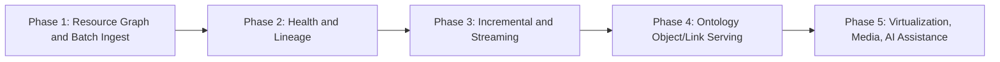

Phase details:

| Phase | Deliver |
| --- | --- |
| 1 | source catalog, credentials, platform worker, direct/agent proxy networking, file/JDBC/REST connectors, raw landing, Iceberg datasets, upload connector |
| 2 | run ledger, transaction history, health checks, monitoring views, alert routing, lineage graph |
| 3 | incremental cursors, file APPEND mode, CDC, Kafka/Redpanda streams, listener gateway, quarantine |
| 4 | ontology registry, object type mapping, link type mapping, object/link validity, object API, graph/search indexes |
| 5 | virtual tables/media, media sets, OCR/chunking/embeddings, AI schema/rule/mapping suggestions, marketplace connector packages |

## Non-Negotiable Engineering Requirements

- Source credentials must be encrypted, scoped, rotated, and never emitted in logs.
- Network egress must be explicit per source and policy-reviewed.
- Every sync run must have a stable run id, manifest, status, metrics, and source cursor/offset record.
- Every dataset commit must be atomic from the user's trusted view.
- Every data asset must have owner, permissions, lineage, schema or declared schemaless state, and retention policy.
- Every validity rule must have owner, severity, action, scope, version, and historical result store.
- Every operational monitor must have scope, threshold or anomaly model, severity, subscription, and snooze/escalation behavior.
- Object and link types must declare stable identity rules before they can serve applications.
- Quarantine must be replayable.
- Observability must cover workers, agents, sources, syncs, datasets, streams, object APIs, and UI actions.

## Recommended Naming

To keep the system familiar without copying product names:

| Palantir-like concept | This system name |
| --- | --- |
| Data Connection | Connect |
| Source | Source |
| Foundry worker | Platform worker |
| Agent proxy | Edge agent proxy |
| Agent worker | Edge worker |
| Dataset | Dataset |
| Stream | Stream |
| Media set | Media set |
| Data Health | Health |
| Monitoring view | Monitoring view |
| Health check | Validity check or health monitor, depending on purpose |
| Ontology Manager | Object Model Manager |
| Object type | Object type |
| Link type | Link type |
| Data Lineage | Lineage |

